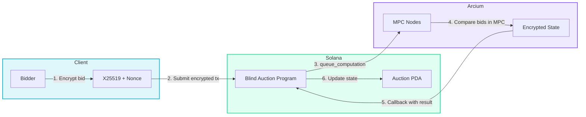

<p align="center">
  
  
  
  
  
  <a href="https://blind-auction-frontend.vercel.app"></a>
</p>

# Blind Auction on Arcium

**Privacy-preserving sealed-bid auctions powered by Arcium's Multi-Party Computation network on Solana.**

All bids are encrypted end-to-end. No one -- not the auctioneer, not other bidders, not even the validators -- can see bid amounts until the auction closes. Only the winner is revealed.

> **Program ID:** `EGePzFcrUy9d9uxQk7eutiAjUK1kbXHs8FydhMTZWJXX`
> **Live Frontend:** [blind-auction-frontend.vercel.app](https://blind-auction-frontend.vercel.app)
> **RTG Submission:** [rtg.arcium.com/rtg](https://rtg.arcium.com/rtg)

---

## The Problem

Traditional onchain auctions are completely transparent. Every bid is visible to everyone, enabling:

| Attack | How It Works | Impact |
|--------|-------------|--------|
| **Front-running** | Watch mempool, outbid by $0.01 | Honest bidders always lose |
| **Bid sniping** | Last-second bid based on known highest | No time to respond |
| **Collusion** | Coordinate bids using visible amounts | Artificially low prices |
| **Market manipulation** | Reveal trading intent to the world | Information leakage |

**Blind Auction eliminates all of these.** Bids are encrypted using Arcium's MPC -- they never exist in plaintext anywhere onchain.

---

## Features

### Sealed-Bid Auction
- **Encrypted bids** -- amounts are never visible onchain, not even to validators
- **Fair competition** -- no bidder can see or react to another's bid
- **Verifiable computation** -- every MPC result is cryptographically verified onchain
- **Minimal reveal** -- only winner + winning amount revealed at close

### Vickrey Auction (Second-Price)
- Winner pays the **second-highest bid**, not their own
- Incentivizes truthful bidding (dominant strategy)
- Tracks both first and second highest bids entirely in encrypted space
- Used by Google Ads, spectrum auctions, and major platforms

---

## Architecture



### Data Flow

```
Bidder encrypts bid locally (X25519)
    |
    v
Solana Program receives encrypted ciphertexts
    |
    v
queue_computation() sends to Arcium MPC nodes
    |
    v
MPC nodes jointly compute comparison (no single node sees plaintext)
    |
    v
Signed result returned via callback instruction
    |
    v
Onchain state updated (auction PDA)
```

---

## Privacy Guarantees

| Data | During Auction | After Close |
|------|---------------|-------------|
| Your bid amount | Encrypted | Encrypted (unless you won) |
| Whether you bid | Public (tx visible) | Public |
| If you're winning | Only you know (via MPC result) | Only you know |
| Highest bid amount | Encrypted | Revealed (winner only) |
| Number of bids | Public | Public |
| Other bids' amounts | Encrypted | **Permanently encrypted** |

---

## Technical Deep-Dive

### 1. ARCIS Circuits (`blind-auction/encrypted-ixs/src/lib.rs`)

The core MPC logic runs inside Arcium's encrypted execution environment using ARCIS:

```rust
#[instruction]
pub fn place_bid(
    current_state: Enc<Mxe, AuctionState>,  // Encrypted with MXE key
    new_bid: Enc<Shared, EncryptedBid>,      // Encrypted with bidder's key
) -> (Enc<Mxe, AuctionState>, Enc<Shared, BidResult>) {
    let state = current_state.to_arcis();
    let bid = new_bid.to_arcis();

    // All comparisons happen on encrypted data inside MPC
    let is_higher = bid.amount > state.highest_bid;

    let new_highest_bid = if is_higher { bid.amount } else { state.highest_bid };
    let new_highest_bidder = if is_higher { bid.bidder_id } else { state.highest_bidder };

    // Bidder only learns if they're winning -- not the actual highest bid
    let result = BidResult {
        is_winning: if is_higher { 1 } else { 0 },
        total_bids: state.bid_count + 1,
    };

    (
        Enc::<Mxe, AuctionState>::from_arcis(updated_state),
        new_bid.owner.from_arcis(result)  // Encrypted back to bidder
    )
}
```

**Key design:** `Enc<Mxe, _>` means data encrypted with the MXE cluster key -- no single party can decrypt. `Enc<Shared, _>` means data shared between the bidder and MPC nodes.

### 2. Solana Program (`blind_auction_lib.rs`)

The on-chain program manages auction lifecycle and bridges to Arcium:

```
Auction Account Layout (90 bytes):
+------------+----------+----------+----------+----------+---------+------+
| Discrim.   | AuctionID| Authority| EndTime  | MinBid   |Finalized| Bump |
| 8 bytes    | 32 bytes | 32 bytes | 8 bytes  | 8 bytes  | 1 byte  |1 byte|
+------------+----------+----------+----------+----------+---------+------+

PDA Seeds: ["auction", auction_id]
```

**Three computation definitions** registered on Arcium:
- `init_auction` -- Initialize encrypted zero state
- `place_bid` -- Compare encrypted bid with current highest
- `close_auction` -- Reveal winner and winning amount

Each instruction uses `queue_computation()` to dispatch to Arcium's MPC nodes and receives results via `#[arcium_callback]` instructions.

### 3. Frontend (`blind-auction-frontend/`)

- **Next.js 14** with TypeScript
- **Solana Wallet Adapter** (wallet-standard auto-detection)
- **Real-time auction browsing** via `getProgramAccounts` with discriminator filtering
- **Glassmorphism UI** with Arcium-inspired gradients and animations
- Deployed on **Vercel**: [blind-auction-frontend.vercel.app](https://blind-auction-frontend.vercel.app)

---

## Project Structure

```
blind-auction-arcium/
|
+-- blind_auction_lib.rs            # Deployed Solana program (complete)
+-- arcium-setup.sh                 # Dev environment setup script
|
+-- blind-auction/                  # Backend
|   +-- encrypted-ixs/
|   |   +-- src/lib.rs              # ARCIS circuits (MPC logic)
|   +-- programs/
|   |   +-- blind-auction/
|   |       +-- src/lib.rs          # Anchor program (mirrors deployed)
|   +-- Arcium.toml
|   +-- Anchor.toml
|
+-- blind-auction-frontend/         # Frontend
    +-- src/
    |   +-- app/
    |   |   +-- page.tsx            # Main auction UI
    |   |   +-- layout.tsx          # App shell
    |   |   +-- globals.css         # Animations & glassmorphism
    |   +-- components/
    |   |   +-- Logo.tsx            # Arcium-inspired logo
    |   |   +-- WalletContextProvider.tsx
    |   |   +-- AppWrapper.tsx
    |   +-- idl/
    |   |   +-- blind_auction.ts    # Program IDL
    |   +-- utils/
    |       +-- program.ts          # Account parsing & helpers
    +-- package.json
    +-- tailwind.config.js
```

---

## Quick Start

### Prerequisites

- Rust (latest stable)
- Solana CLI v2.3.0+
- Anchor 0.32.1
- Arcium CLI
- Node.js 18+

### Build & Deploy

```bash
# Install Arcium CLI
curl --proto '=https' --tlsv1.2 -sSfL https://install.arcium.com/ | bash

# Build the program + ARCIS circuits
cd blind-auction
arcium build

# Deploy to devnet
solana program deploy target/deploy/blind_auction.so \
  --url devnet --use-rpc

# Initialize MXE
arcium mxe init --cluster-id <id> --recovery-set-size 4

# Upload circuits
arcium mxe upload-circuit build/init_auction.arcis
arcium mxe upload-circuit build/place_bid.arcis
arcium mxe upload-circuit build/close_auction.arcis
```

### Run Frontend

```bash
cd blind-auction-frontend
npm install
npm run dev
# Open http://localhost:3000
```

---

## Deployment Status

| Component | Status | Details |
|-----------|--------|---------|
| Solana Program | Deployed | `EGePzFcrUy9d9uxQk7eutiAjUK1kbXHs8FydhMTZWJXX` on devnet |
| ARCIS Circuits | Built | 3 circuits (init, bid, close) + 2 Vickrey variants |
| MXE Cluster | Initialized | Cluster 456, key generation in progress |
| Frontend | Live | [blind-auction-frontend.vercel.app](https://blind-auction-frontend.vercel.app) |

---

## Author

**giwaov** -- Arcium RTG Submission

## License

MIT

## Links

- [Live Demo](https://blind-auction-frontend.vercel.app)
- [Arcium RTG Program](https://rtg.arcium.com/rtg)
- [Arcium Documentation](https://docs.arcium.com/)
- [Solana Anchor](https://www.anchor-lang.com/)
